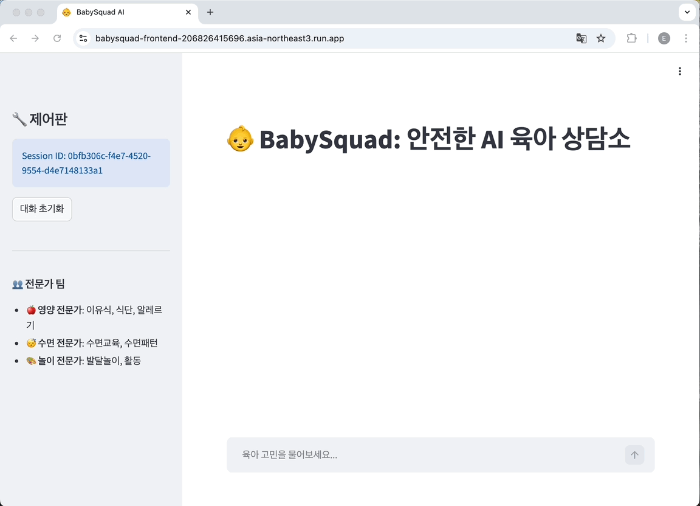

# 👶 BabySquad: Production Multi-Agent RAG System

A Practical Multi-Agent System for Evaluating, Improving, and Shipping LLM Agents

[](https://opensource.org/licenses/MIT)
[](https://www.python.org/downloads/)
[](https://github.com/langchain-ai/langgraph)

> **"It takes a village to raise a child. BabySquad is your AI village."**

BabySquad is a hands-on experiment exploring a simple question:

> **Are multi-agent systems actually better than a single prompt?**


[🔗 Live Demo](https://babysquad-frontend-206826415696.asia-northeast3.run.app/) | [📄 Blog Series](https://medium.com/@eunjikim2u/are-multi-agent-systems-really-better-30970254b286)

This repository accompanies a 3-part Medium series where I:
- compared Single Prompt vs Multi-Agent approaches,
- evaluated them using LLM-as-Judge,
- and incrementally redesigned the system to make it production-ready.

📊 Current Results (LLM-as-Judge, internal benchmark)
- Single Prompt baseline: ~38%
- Multi-Agent (v2, evaluated): 82.8%
- Single-domain questions: 100% accuracy
- 3-domain synthesis: 0% (known limitation)

📚 Related content
- Blog series: [Are Multi-Agent Systems Really Better?](https://medium.com/@eunjikim2u/are-multi-agent-systems-really-better-30970254b286)

## 🎯 What This Project Is (and Isn’t)
This project is:
- ✅ A realistic multi-agent reference built with LangGraph
- ✅ A reproducible evaluation framework (LLM-as-Judge)
- ✅ A production-minded system (HITL, cost awareness, deployment)

This project is NOT:
- ❌ A “multi-agent solves everything” demo
- ❌ Optimized for every edge case
- ❌ Claiming multi-agent is always better

## System Overview

```
User Question
    ↓
[Complexity Router]
    ├─ Simple → [DirectAnswer] ──┐
    │                            │
    └─ Complex → [Orchestrator]  │
           ↓                     │
    [ExpertExecution]            │
           ↓                     │
    [Synthesizer] ───────────────┘
                                 ↓
                          [RiskAnalyzer]
                                 ↓
                    ┌────────────┴─────────────┐
                    ▼                          ▼
            [Human_Review]                   [END]
            (interrupt 🛑)                 (안전한 답변)
                    ↓
            Backend analyze_risk()
                    ↓
            ┌───────┴────────┐
            ▼                ▼
           RISK             SAFE
     (review_needed)       (자동 승인)
```
This architecture reflects the key lessons learned throughout the blog series:
- Not every question needs agents
- Routing matters
- Synthesis is harder than execution
- Safety must exist outside the graph

## 🧠 Core Design Decisions

### 1. Hybrid Routing (Simple vs Complex)
Simple questions bypass agents entirely.
Complex questions trigger expert orchestration.

→ Faster, cheaper, and often better.

### 2. Dynamic Expert Pool
Experts are registered via a registry pattern:
- Nutrition
- Sleep
- Play

New experts can be added without changing the graph.

### 3. Explicit Synthesis (and its limits)
- 2-domain synthesis works well (~83%)
- 3-domain synthesis fails consistently (0%)

**This is not a prompt issue — it’s an architectural one.**

## 📊 Evaluation: LLM-as-Judge
Evaluation comes before optimization.

Each answer is scored across 5 dimensions (25 pts total):
- Accuracy
- Expert Depth
- Actionability
- Multi-domain Integration
- Conciseness

This made failure modes obvious — and fixable.

```bash
# Run evaluation
python batch_evaluate.py -n 10
```

Results are saved as .xlsx for inspection and iteration.

## 🔒 Safety: Human-in-the-Loop (HITL)

Medical or risky advice is handled outside the agent graph.

### 2-stage risk detection:

1. Keyword-based fast filter (cheap)
2. LLM-based risk validation (precise)

Only truly risky answers trigger human review.

## 🛠️ Tech Stack
- LangGraph — agent orchestration
- GPT-4o / GPT-4o-mini — experts & routing
- Pinecone — optional RAG
- FastAPI — backend
- Streamlit — UI
- LangSmith — tracing & debugging

## 💡 Key Learnings (TL;DR)
- ✅ Multi-agent can outperform single prompt
- ❌ Only if evaluation, prompts, and routing are done first
- ⚠️ Synthesis becomes the bottleneck very quickly
- 🧠 Architecture > clever prompting
- 🧪 Measurement beats intuition

## 🚧 Known Limitations
- 3-domain synthesis fails
- Experts run sequentially (latency)
- RAG content is minimal

These are **documented, intentional trade-offs**, not oversights.

## 👩‍💻 Author
Built by Eunji Kim
- Medium: [@eunjikim2u](https://medium.com/@eunjikim2u)
- LinkedIn: [linkedin.com/in/eunjikim2u](https://www.linkedin.com/in/eunjikim2u/)
- YouTube: [@the-coding-cat](https://www.youtube.com/@the-coding-cat)